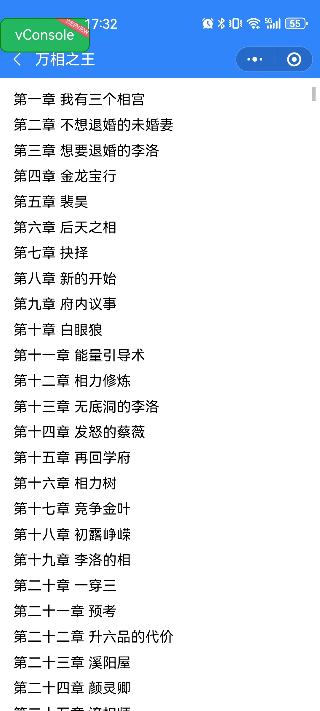

# ws-book-front
基于uni-app开发的小说阅读App模板

## 特点
* 兼容多个平台
* 自定义组件实现顶部选项卡切换
* App 平台使用 nvue 进一步优化体验

### 平台支持
* app-vue
* app-nvue
* H5
* 微信小程序
* 支付宝小程序
* 百度小程序
* 头条小程序

## 注意事项
* 非 App-nvue 平台暂不支持下拉刷新

## 配套的Java后台、前端管理系统

* [前端](https://github.com/shuaiwu1108/ws-book-front)
* [后端](https://github.com/shuaiwu1108/ws-book)

## 页面

